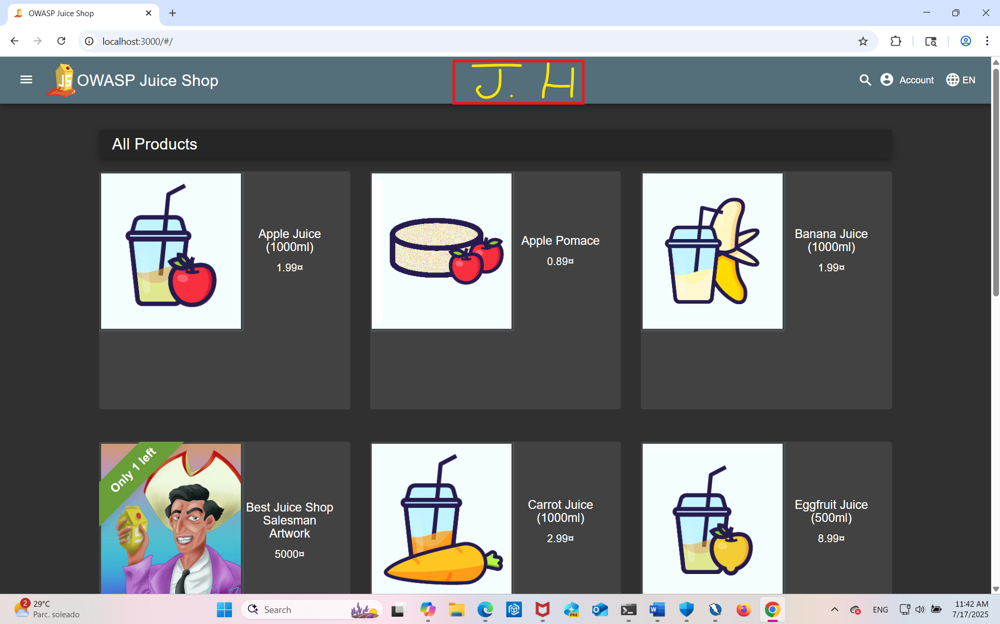

# 🛡️ Laboratorio de Seguridad Web – OWASP Juice Shop / Web Security Lab

## 📌 Descripción / Project Overview

🇪🇸 Este proyecto documenta el análisis de vulnerabilidades en la aplicación OWASP Juice Shop mediante escaneo dinámico con OWASP ZAP. Se simuló un entorno de evaluación realista utilizando Docker y se aplicaron prácticas defensivas para mitigar riesgos como inyecciones SQL, XSS y fugas de sesión.  
🇬🇧 This project documents vulnerability assessment in OWASP Juice Shop through dynamic scanning with OWASP ZAP. A realistic evaluation environment was simulated using Docker, applying defensive practices to mitigate risks such as SQL injections, XSS, and session leaks.

---

## ⚙️ Tecnologías / Technologies Used

- 🐳 Docker Desktop
- ⚡ OWASP Juice Shop
- 🔍 OWASP ZAP (DAST Scanner)
- ☕ Java SE 17

---

## 📚 Documentación / Documentation

| Archivo | Descripción | Idioma |
|--------|-------------|--------|
| [`setup_EN.md`](./docs/setup_EN.md) | Instalación de Juice Shop y ZAP | Español 🇪🇸 |
| [`setup_ES.md`](./docs/setup_ES.md) | Setup for Juice Shop and ZAP | English 🇬🇧 |
| [`analysis_ES.md`](./docs/analysis_ES.md) | Análisis y remediación | Español 🇪🇸 |
| [`analysis_EN.md`](./docs/analysis_EN.md) | Vulnerability analysis and fixes | English 🇬🇧 |
| [`conclusions_ES_EN.md`](./docs/conclusions_ES_EN.md) | Conclusión bilingüe | ES / EN 🇪🇸🇬🇧 |

---

## 🖼️ Evidencias / Technical Evidence

📁 [`/assets`](./assets)

- Docker running container (`docker_screenshot.png`)
- ZAP scan results (`zap_scan_results.png`)
- Juice Shop browser view (`juice_shop_browser.png`)

📁 [`/evidences`](./evidences)  
Opcional: logs, reportes HTML, exportaciones técnicas

---

## 🎯 Aprendizajes Clave / Key Learnings

- 🧠 Aplicación práctica de escaneo DAST
- ✍️ Redacción técnica bilingüe reproducible
- 🔐 Mitigación de vulnerabilidades OWASP Top Ten
- 🛠️ Troubleshooting con herramientas reales en entornos simulados

---

## 📎 Referencias / References

- [OWASP Juice Shop Project](https://owasp.org/www-project-juice-shop/)
- [OWASP ZAP Documentation](https://www.zaproxy.org/docs/)
- [OWASP Top 10 Web Application Risks](https://owasp.org/www-project-top-ten/)
- [Docker Desktop](https://www.docker.com/products/docker-desktop)
- [Java SE 17 Archive Downloads](https://www.oracle.com/java/technologies/javase/jdk17-archive-downloads.html)

---

## 🙌 Autora / Author

**Jocelyne Herrera Hidalgo**  
Bilingual IT Support Analyst & Cybersecurity Student  
